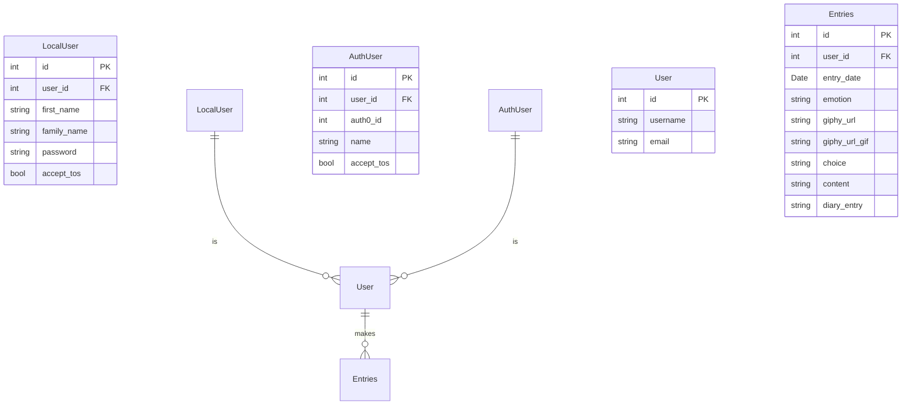

## 🥹 Welcome To GIFeels 🥹

GIFeels is a mood tracker web app. It is built using Python-Flask, MySQL, Jinja, HTML, CSS and JavaScript, and integrates 3 external APIs. 

## 👩🏼‍💻 User Stories

On the homepage, the user is invited to select the gif that best represents their mood. Once selected, they are offered a choice between an inspirational quote or joke to improve their mindset. They are given the option to save this. 

If they select save, they will be invited to log in (or register). Once logged in, they can save their mood and joke/quote. They will then be invited to journal their thoughts for the day and save them. After saving, they will be shown their overview for the month, giving a summary of their emotions and letting them view entries for individual days. 

  

## 🧬 Project Structure: 

### Entity Diagram 

The project uses Flask-SQLAlchemy to manage interactions with the database and as an Object Relational Mapper. The mapped classes (corresponding to database tables) are outlined below:

  

## ✅ Requirements

- A virtual environment on your IDE to install requirements from requirements.txt
- Install and activate Redis server: 

| System  | Method                                                                                                                                                                                                                                                                                                                                                                                                                                                                                    |
|---------|-------------------------------------------------------------------------------------------------------------------------------------------------------------------------------------------------------------------------------------------------------------------------------------------------------------------------------------------------------------------------------------------------------------------------------------------------------------------------------------------|
| MacOS   | `brew install redis`   `brew services start redis`                                                                                                                                                                                                                                                                                                                                                                                                                                    | 
| Linux   | `sudo apt-get install lsb-release curl gpg`   `curl -fsSL https://packages.redis.io/gpg  \| sudo gpg --dearmor -o /usr/share/keyrings/redis-archive-keyring.gpg`   `sudo chmod 644 /usr/share/keyrings/redis-archive-keyring.gpg`  `echo "deb [signed-by=/usr/share/keyrings/redis-archive-keyring.gpg] https://packages.redis.io/deb $(lsb_release -cs) main" \| sudo tee /etc/apt/sources.list.d/redis.list`   `sudo apt-get update`   `sudo apt-get install redis` |                                                 |
| Windows | ~~Turn back now before it is too late.~~ Redis is not officially supported on Windows, so <a href="https://redis.io/docs/latest/operate/oss_and_stack/install/install-redis/install-redis-on-windows/">follow this guide<a/> for how to use it in development                                                                                                                                                                                                                             |

- MySQL Workbench for the database (or equivalent)
- A developer API key from the [Giphy developers website](https://developers.giphy.com/)
- Create an account with Google Cloud using their free trial and follow [this guide](/https://support.google.com/cloud/answer/6158849?hl=en&ref_topic=3473162&sjid=2552074629382520305-EU) to generate the correct credentials for using Oauth. The required app details are below: 

| Field                       | Value                                                                                                              |
|-----------------------------|--------------------------------------------------------------------------------------------------------------------|
| App Name                    | GIFeels                                                                                                            |
| Test users                  | `your-email`                                                                                                       |
| Allowed JavaScript origins: | https://127.0.0.1:443, https://localhost:443, http://localhost:443                                                 |
| Allowed redirect URIs       | https://127.0.0.1:443/authorize/google, https://localhost:443/authorize/google, http://127.0.0.1/authorize/google  |

  

> :bulb: **In a rush?** Run the app without Google OAuth and skip step 3 in the set-up below.
> You will need to change app.run on [run.py](/run.py) to `app.run(debug=True), host='0.0.0.0', port=5500)`. Please note certain endpoints related to OAuth will not function correctly. 

  

## 📋 Set-up 

  

1. Create a new file at root level called .env. Copy and paste the template from [template_env](/template_env) and add your GIPHY API key, Google Auth Client Id, Key and Domain, MySQL user and password where indicated. (Using .env will keep your personal information secure)
2. Create and activate a virtual environment, then install all requirements from [requirements.txt](/requirements.txt)
3. Set up an SSL certificate using the terminal commands below (providing information when prompted), and save these in the directory [certs](/certs). Check these are correctly added to your .gitignore.

`$ pip install pyopenssl`

`openssl req -x509 -newkey rsa:4096 -nodes -out cert.pem -keyout key.pem -days 365`

4. Navigate to MySQL Workbench or equivalent GUI and run the following command: 

`CREATE DATABASE Mood_Tracker`

5. Run the following commands on terminal to migrate the database using Flask-Migrate:

`flask db upgrade`

6. Run [run.py](/run.py) to launch the app 

  

## ➡️ Running the app: 

You can run the app via an IDE, like Pycharm, or Docker. Please note: the front-end design has been optimised for Google Chrome Browser and for the best experience, we'd recommend using this.

### 💻 _IDE_

By running app.py in your IDE you will be able to launch https://127.0.0.1:443 (or http://127.0.0.1:5500 if not using HTTPS) and go to the homepage of the app.

### 🐳 _Docker_

Ensure you have Docker installed on your device. You can follow [this guide](https://docs.docker.com/get-started/get-docker/). Run [compose.yml](compose.yml). This uses nginx to provide a reverse proxy to the app's container. The app will be accessible at https://127.0.0.1:443.

  

## 🥹 Using the app: 

The app will guide you through choosing how you feel and offer a choice for a joke or a quote. It will then allow you to add a journal entry.

You are able to visit the pages without logging into the app, however this will not allow you to save entries or have an overview of the recorded entries.

You can login as one of the mock users created, or register your own user following the instructions on screen.

  

### Mock users credentials

1. Mock user who is registered and has database entries from 01/05/2024 to 13/06/2024:\
Username: JoDoe\
Password: password123

2. Mock user who is registered only:\
Username: LSmith\
Password: hello123

  

## 🤩 Features

| Feature                                                            | Image                                                                                                                                                                                                             |
|--------------------------------------------------------------------|-------------------------------------------------------------------------------------------------------------------------------------------------------------------------------------------------------------------|
| OAuth with Google |    |
| Overview page with bar graph & calendar linking to journal entries |     |
| Previous selected GIFs displayed on mouse hover on calendar dates |     |
| Calendar entries colour coded to 'emotion' with selected gif displayed on mouse hover on bar graph |  |
| On archive page, user can dynamically update journal entry. This is saved using an AJAX call.   |                              |
| Complete suite of unit tests, including in memory database using SQLite for database tests |    |
| Database migration with Flask-Migrate |      |
| Rate limiter with REDIS |    |
| Authentication decorator on restricted endpoints |    |
| CSRF protection on all user POST/PUT/DELETE requests |          |

  

## 🔮  Future Development 

We are currently working on taking this app to deployment. Features currently in development to help us take this next step are: 
- AI recommendations through the Google Gemini API 

  

## 👥  Developers

This project was initially created on the Code First Girls CFGDegree with the below developers. [@Rachel-Tookey](https://www.github.com/Rachel-Tookey) and [@Fabi-P](https://www.github.com/Fabi-P) forked off the initial repo and have continued development, implementing a modular code structure, ORMs with SQLalchemy, OAuth and interactive web elements with Javascript. 

Laura: https://github.com/Laura-Kam \
Fabi: https://github.com/Fabi-P \
Rachel: https://github.com/Rachel-Tookey \
Alyssa: https://github.com/lyscodes \
Hannah: https://github.com/HannahTInsleyMcRink
